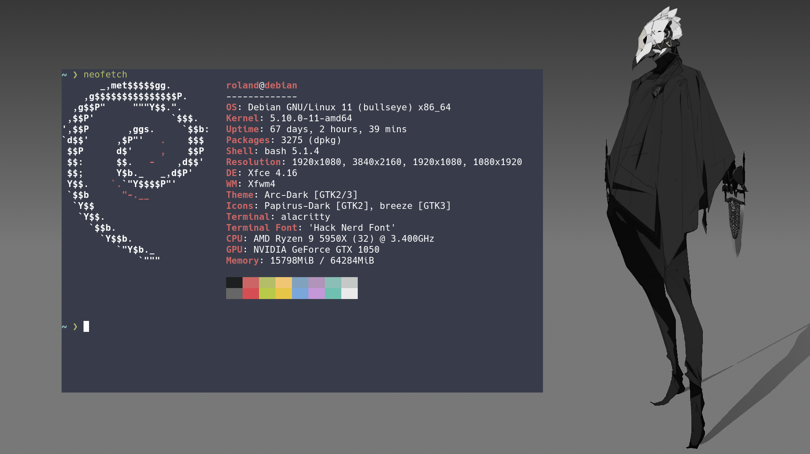

# Rolands Dotfiles

Symlink dotfiles using rolandwarburton/casa.

```none
go install github.com/rolandwarburton/casa@latest
casa -c install.config.yaml
```

Pairs with [rolandwarburton/ansible-configs](https://github.com/RolandWarburton/ansible-configs)
to configure a system from scratch.
